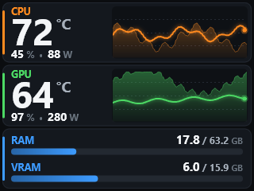
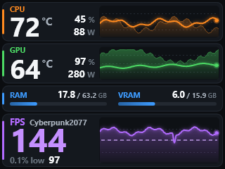

# Darkmount Hub

A tray app for the **be quiet! Dark Mount** keyboard:
- live PC stats, animations and alerts on the **media dock screen**;
- **full keyboard customisation**: lighting, per-key RGB animations, key remapping, macros, display keys, Game Mode and profiles.

It replaces IO Center while it runs.

 

## Features

### Media dock screen
- **Stats dashboard:**
  - CPU and GPU temperature (largest), power (W) and load (%), with wave graphs
  - RAM and VRAM usage bars
  - An FPS row that appears automatically in games, showing FPS and the 0.1% (or 1%) low
- **Animation screen:** built-in themes (Plasma, Matrix rain, Starfield), your own GIF or video, or a folder of pictures. This is a slideshow; see *Hardware limits*.
- **be quiet! default screen:** hands the dock back to its own menu while keyboard features keep working.
- **Switching screens:** automatic (stats while a game runs), from the tray menu, or with the hotkey **Ctrl+Alt+Shift+D**, which cycles Dashboard → Animation → be quiet! default.
- **Alerts:** hot CPU or GPU, RAM or VRAM nearly full, or FPS dropping in a game. The stats move down so nothing is hidden.
- **Dock controls stay usable:** the dashboard pauses for 3 s whenever you use the dial or a dock button.

### Keyboard
- **Lighting:** the keyboard's six built-in effects (Static, Color wave, Tornado, Breathing, Reactive, Matrix) with single, dual or gradient colours (up to 7), direction, brightness and speed. These are stored on the keyboard.
- **RGB effects:** Darkmount Hub animates all 201 LEDs through the standard Windows lighting interface.
  - Rainbow wave and Plasma set each key individually (about 7–14 fps).
  - Breathing, Colour cycle, CPU-temperature colour and Static colour the whole keyboard (up to 30 fps).
  - Optional red flash while a dock alert is showing.
- **Keys:** remap any key on the normal or Fn layer, including the 8 display keys and the 4 dock buttons (the dock must be in its CUSTOM mode). A key can become:
  - another key or a shortcut
  - F13–F24
  - a media key
  - a mouse button (double click, hold or auto-fire) or scroll
  - a Windows shortcut
  - a lighting control
  - a special character
  - "open website"
  - disabled
- **Game Mode:** choose which combinations Fn+Pause blocks (Win, Alt+Tab, Alt+F4, Shift+Tab, Caps Lock).
- **Display keys:** your own picture on each of the 8 LCD keys.
- **Macros:** record or build steps (keys, text, delays, mouse, media keys, programs, websites, folders), test them, and bind any key to trigger them. Macros run on the PC.
- **Profiles:** save complete setups, apply one with a click, switch automatically when a given game starts, and restore your original keyboard settings.
- **Dock settings:** menu colour, 12/24-hour clock, and what the dock shows when Darkmount Hub isn't driving it.

## Requirements

- Windows 10 or 11, and a be quiet! Dark Mount (with the media dock for the screen features).
- **MSI Afterburner** running, for CPU and GPU temperature, power and load, RAM, VRAM and FPS. For the "0.1% low", enable *Framerate 0.1% low* under Afterburner → Settings → Monitoring.
- **RivaTuner Statistics Server** (installed with Afterburner), which detects which game is running.
- Optional: **HWiNFO** with *Shared Memory Support* enabled. Its values are preferred when available.
- For RGB effects, Windows **Dynamic Lighting** must be off for this keyboard (Settings → Personalization → Dynamic Lighting).

## Install and run

1. Put `DarkmountHub.exe` (a single self-contained file) anywhere, e.g. `C:\Tools\DarkmountHub`.
2. **Close IO Center** (Exit from its tray icon). If IO Center starts while Darkmount Hub runs, Darkmount Hub pauses and hands the keyboard back.
3. Run `DarkmountHub.exe`. If the dock screen is dark, press a dock button once.
4. Double-click the tray icon to open the window.

- **Exit:** use the tray menu, or run `DarkmountHub.exe --exit`. Either way your dock settings are restored.
- **Settings:** `%APPDATA%\DarkmountHub`. This folder also holds `settings.json`, `macros.json` and `profiles.json`, plus the backups `keyboard-backup\`, `display-keys-backup\` and `dock-config-backup.hex`.
- **Logs:** `%LOCALAPPDATA%\DarkmountHub\logs`

## Hardware limits (measured on real hardware)

- **Image format:** the dock accepts only complete 320×240 RGB565 images. Partial updates are not shown. JPEG, PNG and WebP are drawn as raw bytes. Smaller images are shown as a tile, not stretched.
- **Upload method:** images go out as small single-packet writes with 4 in flight, never repeated. That takes **~2.2 s per image**. Large writes make the firmware hold replies, and any repeated chunk makes the dock reject the image.
- **Rest time:** every upload counts as dock activity, so the dock needs a short rest to show the image and react to its buttons. The dashboard therefore refreshes about **every 5 s**. Smooth video on the dock is not possible.
- **Wear:** images live in the keyboard's RAM, so constant updates cause no flash wear. Unplugging resets them.
- **RGB speed:** keyboard RGB goes through the standard HID LampArray interface (201 lamps). A whole-keyboard colour change takes about 5–7 ms; a full per-key frame takes about 130 ms.

## Safety

- **Allowlist:** only allowlisted commands can be sent. The code has no way to send firmware update, factory reset, serial number, raw storage, calibration or polling-rate commands.
- **Bootloader:** it never talks to a keyboard in bootloader mode (PID 0x0009).
- **Backups:** before the first change, the app saves your original dock settings and your complete keyboard setup (lighting, bindings, locks, display-key images). *Profiles → Restore my original keyboard settings* puts them back.

## Build

```
dotnet test tests/Darkmount.Tests
dotnet publish src/Darkmount.App/Darkmount.App.csproj -c Release -o publish --self-contained -p:PublishSingleFile=true -p:IncludeNativeLibrariesForSelfExtract=true -p:DebugType=none
```

## Project layout

| Path | Purpose |
|---|---|
| `src/Darkmount.QLink` | USB protocol (QLink): framing, CRC, sessions, allowlist, media dock commands |
| `src/Darkmount.Dock` | Connection lifecycle, IO Center back-off, config backup, frame uploads |
| `src/Darkmount.Keyboard` | Lighting, bindings, key tables and geometry, display keys, backups, LampArray per-key RGB and effects |
| `src/Darkmount.Sensors` | Afterburner, HWiNFO and RivaTuner readers, game detection |
| `src/Darkmount.Screens` | 320×240 rendering (SkiaSharp): stats, animations, alert banner |
| `src/Darkmount.App` | Tray app, pages, frame pipeline, alerts, RGB engine, macros, profiles |
| `tools/DockBench`, `tools/LampProbe`, `probe/` | Hardware test and diagnostics tools |
| `docs/` | Protocol notes (`QLINK_PROTOCOL.md`, `QLINK_KEYBOARD.md`), design specs and plans |

*Not affiliated with be quiet!. Use at your own risk.*
