<p align="center">
  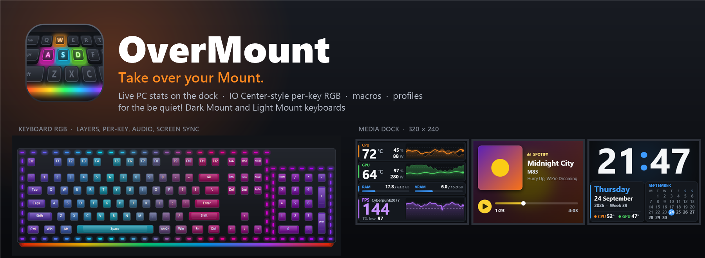
</p>

<p align="center">
  <a href="https://github.com/kosherplay-betatester/overmount/releases/latest/download/OverMount-Setup.exe"></a>
  <br>
  <a href="https://github.com/kosherplay-betatester/overmount/releases/latest"></a>
  
  
  
  <a href="LICENSE"></a>
</p>

**OverMount** takes over your **be quiet! Dark Mount** (and Light Mount) keyboard and makes it do far more than the stock software. You get a live hardware dashboard on the media dock with **FPS and 1% lows** in games. You get IO Center-style **per-key RGB** with layers, paint mode and 32 premade scenes, plus lighting that reacts to your music, your screen and your typing. And you get macros, key remapping, per-game profiles, a focus timer, and one-click import of your IO Center profiles.

It's one small tray app that installs in seconds with no admin rights, and it updates itself.

---

## Highlights

| | |
|---|---|
| 🎮 **Game dashboard on the dock** | CPU/GPU temperature, load and watts with live graphs, RAM/VRAM, and **FPS + 1% low** when a game runs (measured by OverMount itself from RivaTuner frame times). |
| 🌈 **Lighting studio** | Stack up to 8 layers (effects on any keys or edge LEDs), **paint single keys** in any colour, and start from 32 premade scenes. Up to 30 fps. |
| 🎵 **Reactive lighting** | Audio spectrum and audio pulse (from whatever your PC plays), screen sync (Ambilight), typing ripples and heatmaps, and CPU-temperature colours. |
| 🧠 **Smart overlays** | Caps/Num/Scroll lock glow, a volume bar on F1–F12, a red mic-mute key, a shortcut helper while you hold Ctrl/Alt/Win, and focus-timer progress. Lights fade out when you lock the PC. |
| 🖥️ **Six dock screens** | Stats, Now playing (Spotify, browsers…), Clock & calendar, Network, Focus timer, and your own GIF, video or pictures. Rotate them automatically or let smart screens pick. |
| ⌨️ **Total key control** | Remap keys on both layers, set Game Mode locks, use the 8 display keys (with pictures), and record macros that launch apps and type text. |
| 🔁 **Profiles** | Save complete setups, switch automatically per game, and **import IO Center profiles** (lighting, keys, display-key pictures). |
| 🛡️ **Safe by design** | Backs up your original keyboard and dock settings, hands everything back when you exit, and never sends firmware-update, reset or calibration commands. |

---

## The Lighting studio

One **Lighting** page, one switch: **Studio** (OverMount draws layers, per-key colours and reactive effects), **Built-in effect** (the keyboard's own effect, which keeps running without the app), or **Off**. Only one runs at a time, so nothing fights over the LEDs.

<p align="center">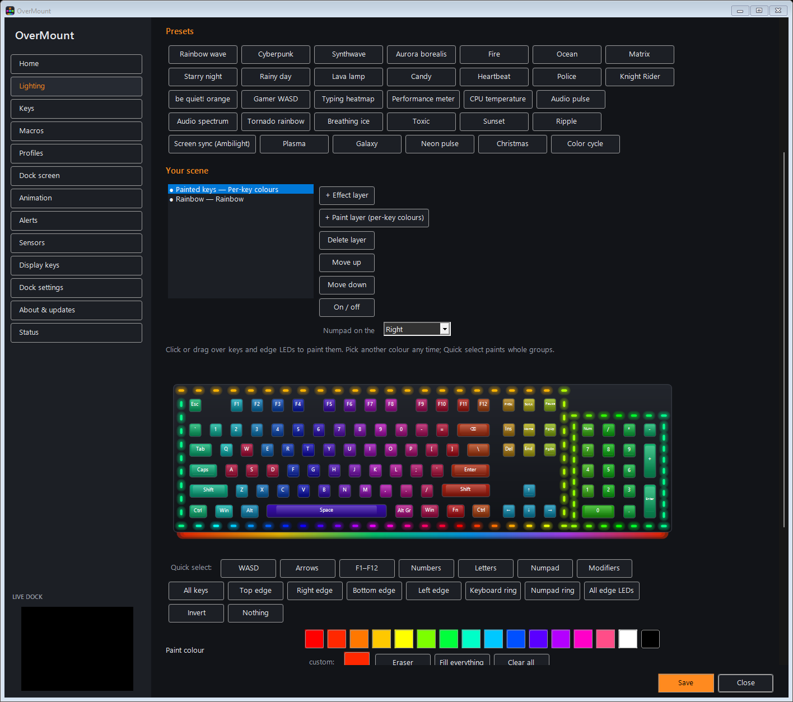</p>

- **Presets**: click one of 32 scenes (Cyberpunk, Synthwave, Aurora, Fire, Gamer WASD, Audio spectrum, Screen sync…), then tweak it.
- **Layers**: each layer is an effect on the keys and edge LEDs you select. Click, Ctrl+click or drag a box to select, or use **Quick select** (WASD, arrows, F-row, numpad, top/bottom/left/right edge, keyboard ring, numpad ring…). The top layer wins; transparent effects such as Reactive and Ripple let the layers below show through.
- **Paint layers** (per-key colours): pick a colour and click or drag over keys and edge LEDs. There's an eraser, *Fill everything* and *Clear all*. This matches IO Center's per-key lighting, and it's faster.
- **Edge LEDs**: all 96 are shown as rings around the keyboard (64) and the numpad (32). Tell OverMount which side your numpad is on.
- **27 effects**: Static, Color wave, Tornado, Breathing, Matrix, Reactive, Ripple, Rainbow, Plasma, Aurora, Fire, Ocean, Twinkle, Rain, Heartbeat, Police, Scanner, Color cycle, CPU temperature, Performance meter, Typing heatmap, Audio pulse, Audio spectrum, Lava, Candy, Screen sync and Per-key colours.

<p align="center">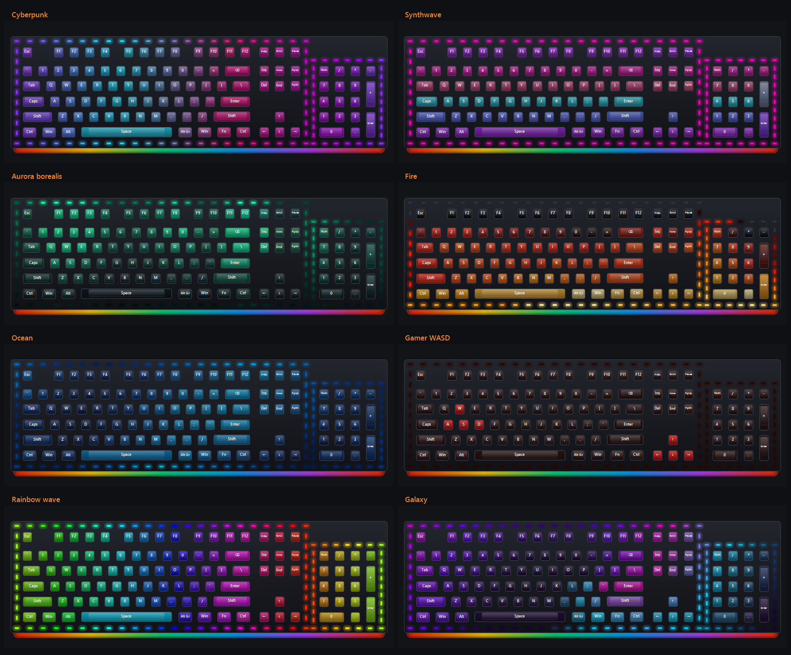</p>

---

## Dock screens

The Dark Mount's 320×240 media dock becomes a second screen:

| Stats (in game) | Stats (desktop) | Alerts |
|:-:|:-:|:-:|
| 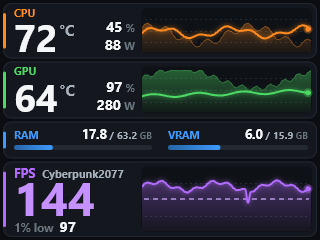 |  | 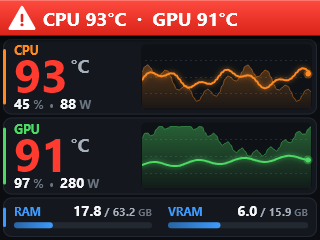 |
| **Now playing** | **Clock & calendar** | **Network** |
| 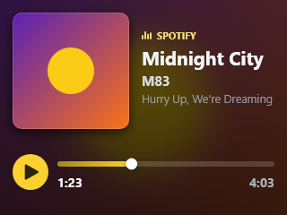 | 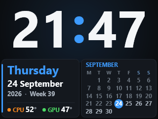 | 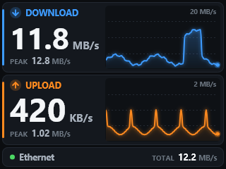 |
| **Focus timer** | **Animation (Plasma)** | **Animation (Matrix)** |
| 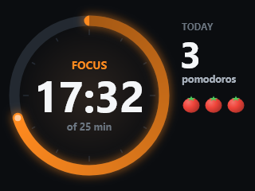 |  | 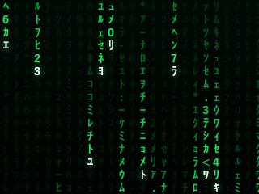 |

- **Auto mode** shows stats while a game runs, and your default screen otherwise.
- **Smart screens** show *Now playing* for 20 s when a new song starts, and the *Focus timer* while it runs.
- **Rotation** takes turns through the screens you pick (every 30 s by default).
- **Alerts** trigger on a hot CPU/GPU, nearly full RAM/VRAM, or FPS drops in games. They show as a red banner, and the keyboard can flash red too.
- **Ctrl+Alt+Shift+D** cycles dashboard → animation → be quiet! default screen. The tray menu has every screen.

---

## Quick start

1. **Download** [`OverMount-Setup.exe`](https://github.com/kosherplay-betatester/overmount/releases/latest/download/OverMount-Setup.exe) and run it. Windows may show *"Windows protected your PC"* because the app isn't code-signed. Click **More info → Run anyway**.
2. Click **Install**. It installs for your account only, with no admin rights, and adds Start-menu and optional desktop shortcuts plus *Start with Windows*.
3. **Exit IO Center** (right-click its tray icon → Exit). If it's still running, OverMount pauses and offers **Take control back** with one click.
4. Double-click the tray icon (the glowing **WASD**). The **Home** page shows what's connected and runs a setup check that fixes common problems for you.

<p align="center">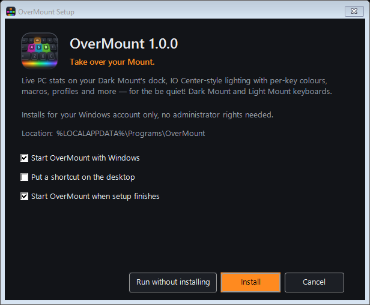</p>

> Coming from IO Center? Open **Profiles → Import from IO Center…**. Your profiles are found automatically (exported `.ioprofile` files work too).

### Recommended companions
- **MSI Afterburner**: CPU/GPU temperatures, power, load, RAM/VRAM and FPS for the dashboard.
- **RivaTuner Statistics Server** (installed with Afterburner): detects the running game. OverMount measures **1% lows** from its frame times, with no extra setup.
- **HWiNFO** (optional): enable *Shared Memory Support* for more precise sensors.
- For Studio lighting, Windows **Dynamic Lighting** must be off for the keyboard. The Home page checks this and opens the right settings page.

---

## How to use

<details>
<summary><b>🏠 Home</b>: status, quick actions and the setup check</summary>

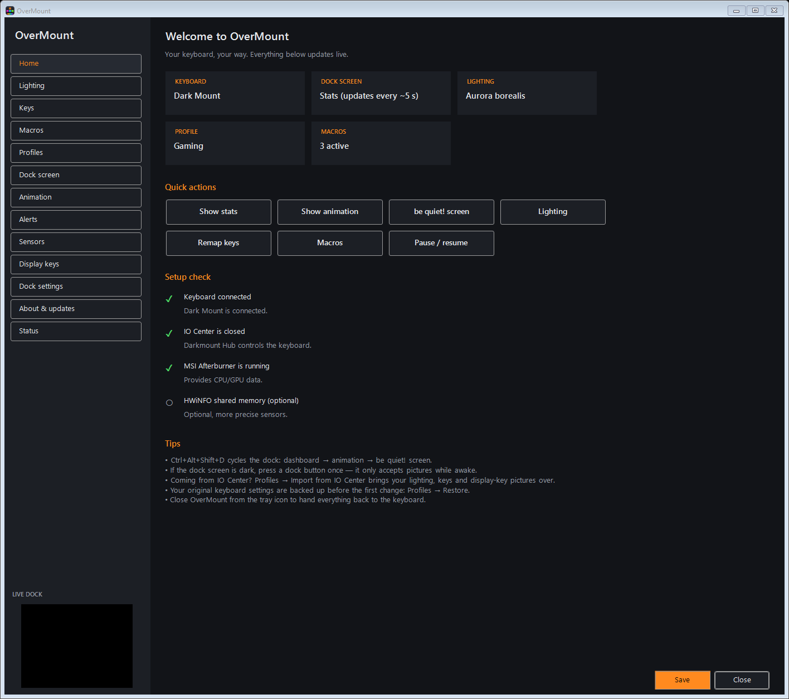

Tiles show the keyboard, dock screen, lighting, active profile and macros. Big buttons switch the dock screen or jump to lighting, keys and macros. The **setup check** tells you exactly what's missing (IO Center running, Afterburner not found, Dynamic Lighting on, dock asleep…), and most items have a **Fix** button.
</details>

<details>
<summary><b>🌈 Lighting</b>: Studio, Built-in effect or Off</summary>

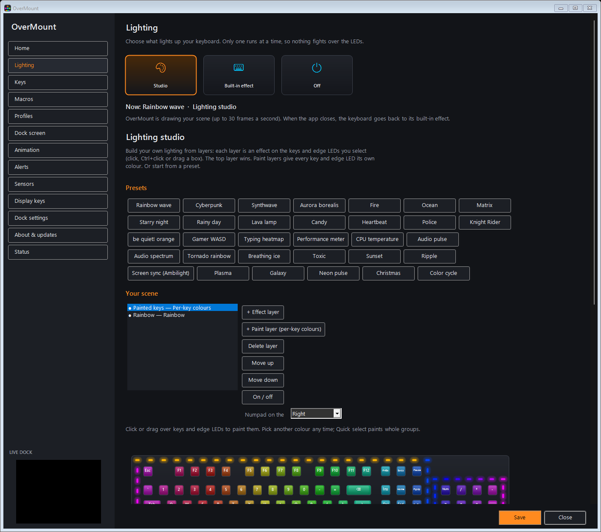

- **Studio**: pick a preset or build layers (see above). **Live extras** adds the overlays: lock keys, volume bar, mic mute, shortcut helper, focus-timer bar, alert flash, and lights-off when locked or idle.
- **Built-in effect**: the keyboard's six on-board effects (Static, Color wave, Tornado, Breathing, Reactive, Matrix) with single, dual or gradient colours, direction, speed and brightness. Changes are saved to the keyboard as you make them and keep working with OverMount closed.
- **Off**: all lighting off.
</details>

<details>
<summary><b>⌨️ Keys</b>: remapping and Game Mode</summary>

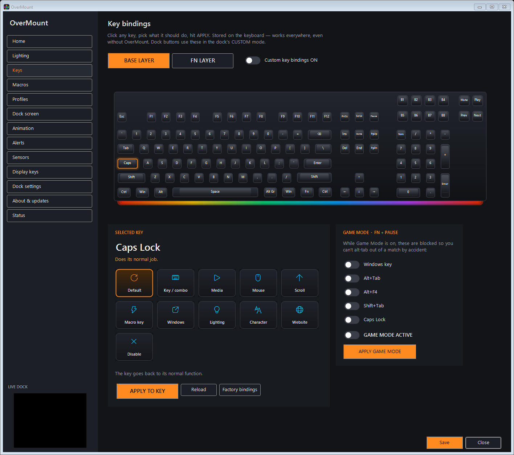

Click a key and choose what it does on the **Base** or **Fn** layer: another key or shortcut, F13–F24, media, mouse buttons (double click, hold, auto-fire) or scroll, Windows shortcuts, lighting control, a special character, a website, or disabled. The 8 display keys and the 4 dock buttons can be remapped too. **Game Mode** (Fn+Pause) choices: block Win, Alt+Tab, Alt+F4, Shift+Tab and Caps Lock.
</details>

<details>
<summary><b>🧩 Macros</b>: record, build, bind</summary>

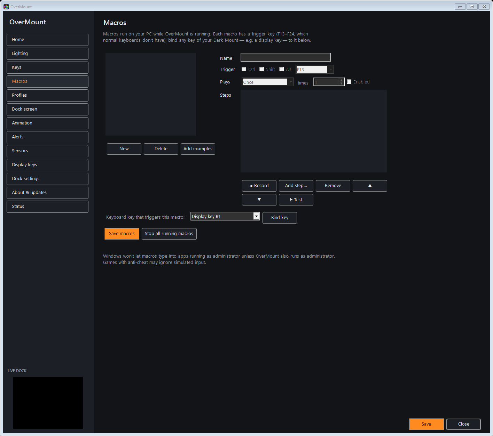

Record keys and mouse clicks, or build steps: keys, text, delays, mouse, scroll, media keys, launch a program, open a folder or website. Play once, repeat, or toggle a loop. **Bind key** makes any keyboard key trigger the macro (it sends F13–F24, which OverMount catches).
</details>

<details>
<summary><b>🔁 Profiles</b>: per-game setups and IO Center import</summary>

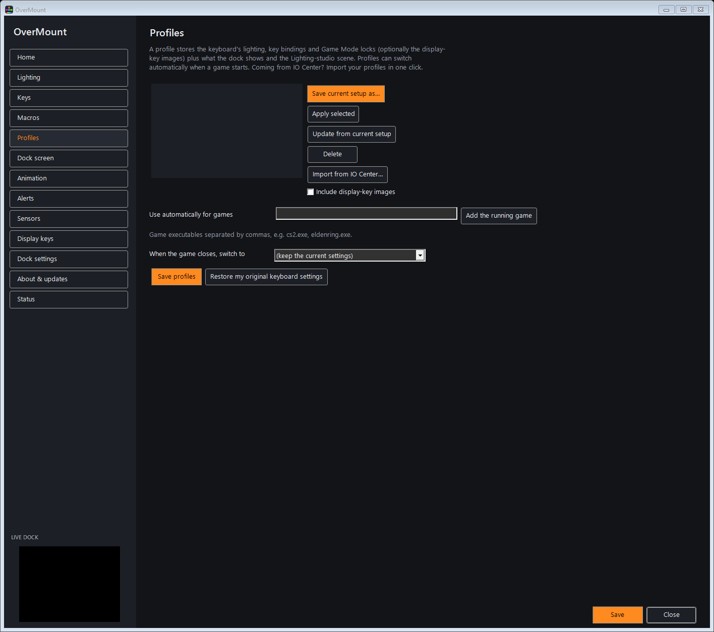

A profile stores the keyboard's lighting, bindings and Game Mode locks (optionally the display-key pictures), plus the dock screen and the Studio scene. Add game executables to switch automatically when a game starts, and pick what to switch back to afterwards.

**Import from IO Center…** brings over custom illumination layers (as a Studio scene, with the same effects, colours, speed and key/LED selections), the built-in effect, key bindings, display-key pictures and the linked game. Keys that *open a program, folder or website* become OverMount macros, so they work without IO Center. IO Center's files are only read, never changed.

**Restore my original keyboard settings** puts back the backup made before OverMount's first change.
</details>

<details>
<summary><b>🖥️ Dock screen & focus timer</b></summary>

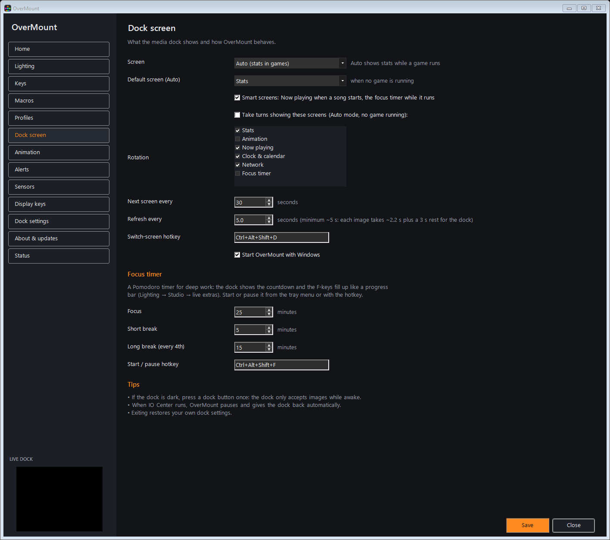

Choose the screen mode, default screen, smart screens and rotation. The **focus timer** (Pomodoro) defaults to 25 min focus, 5 min breaks and a long break every 4th. Start or pause it with **Ctrl+Alt+Shift+F** or from the tray menu. The dock counts down and F1–F12 fill up like a progress bar.
</details>

<details>
<summary><b>⬆️ Updates</b></summary>

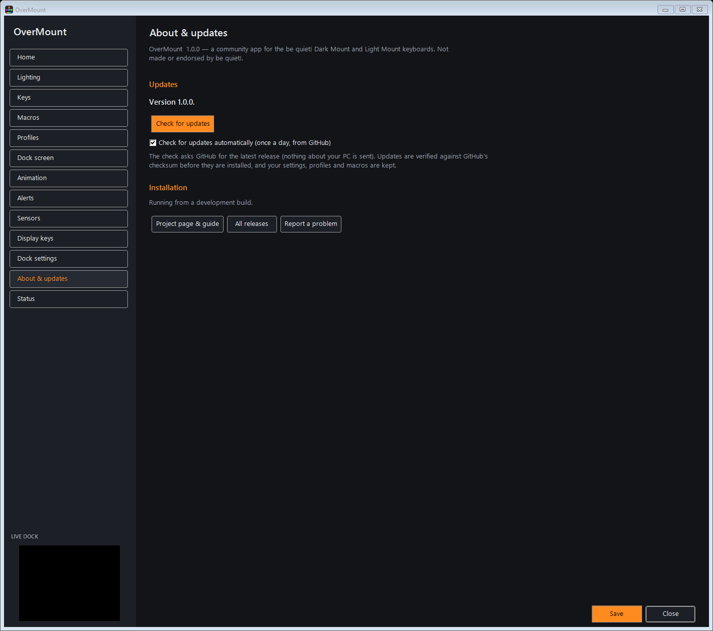

OverMount checks GitHub for a new release once a day (you can turn this off). **Update now** downloads the new setup, checks it against GitHub's SHA-256 checksum, and restarts into the new version. Your settings, profiles and macros are kept.
</details>

---

## FAQ

**The dock screen is dark or shows the be quiet! logo.** Press any dock button once. The dock only accepts pictures while its screen is awake.

**Why does the dock update only every ~5 seconds?** That's the hardware. The dock takes a full 320×240 picture in about 2.2 s and then needs a short rest to stay responsive. Smooth animation lives on the keyboard's RGB instead (up to 30 fps).

**IO Center took over and OverMount stopped.** IO Center keeps driving the keyboard from its tray icon even after you close its window. Click the notification or the tray menu's **Take control back from IO Center**. OverMount closes it and resumes.

**Studio lighting doesn't show.** Turn off Windows *Dynamic Lighting* for the keyboard (Settings → Personalization → Dynamic Lighting). The Home page checks this for you.

**No FPS or 1% low in a game.** RivaTuner Statistics Server must be running (it comes with MSI Afterburner). OverMount measures the 1% low itself from RivaTuner's frame times.

**Light Mount?** Supported with everything except the dock and display-key features, which the Light Mount doesn't have. It's built from the same protocol but hasn't been tested on a real Light Mount yet, so feedback is welcome.

**Uninstall?** Windows Settings → Apps → Installed apps → OverMount → Uninstall, or **About & updates → Uninstall…**. Your keyboard keeps its current settings, and you choose whether to keep your OverMount data.

---

## Hardware limits (measured on a real Dark Mount)

- The dock accepts only complete 320×240 RGB565 images. Partial updates aren't shown, and compressed formats are drawn as raw bytes.
- Uploads are single-packet writes with 4 in flight, never repeated (a repeated chunk makes the dock reject the image): **~2.2 s per image**, then a 3 s rest.
- Dock images live in RAM, so there's no flash wear. Unplugging resets them.
- Keyboard RGB uses the standard HID LampArray interface (201 lamps: 105 keys and 96 edge LEDs). A whole-keyboard colour change takes about 5 ms; OverMount sends only the LEDs that changed.

## Privacy & safety

- **Everything stays on your PC.** Audio-reactive effects analyse what your speakers play (never the microphone), and screen sync samples a 24×8 grid of screen colours. The key-press hook records only *which* key lit up and when, never text. None of it is stored or sent.
- The only network request is the optional update check to GitHub.
- **Allowlisted commands only**: the code has no way to send firmware-update, factory-reset, serial-number, raw-storage, calibration or polling-rate commands, and it never talks to a keyboard in bootloader mode.
- **Backups**: your original dock settings and complete keyboard setup (lighting, bindings, locks, display-key pictures) are saved before the first change. Exiting OverMount restores the dock and hands lighting back to the keyboard.

Files: settings, profiles, macros and backups are in `%APPDATA%\OverMount`, and logs are in `%LOCALAPPDATA%\OverMount\logs`. Upgrading from *Darkmount Hub* (the old name) moves everything over automatically.

---

## Build from source

```powershell
dotnet test tests/Darkmount.Tests
dotnet publish src/Darkmount.App/Darkmount.App.csproj -c Release -o publish --self-contained `
  -p:PublishSingleFile=true -p:IncludeNativeLibrariesForSelfExtract=true -p:DebugType=none
```

The published `OverMount.exe` is also its own installer: run it from anywhere and it offers to install. `--install --silent`, `--uninstall`, `--portable` and `--exit` are available on the command line.

| Path | Purpose |
|---|---|
| `src/Darkmount.QLink` | USB protocol (QLink): framing, CRC, sessions, allowlist, keyboard models |
| `src/Darkmount.Dock` | Connection lifecycle, IO Center back-off, dock config backup, frame uploads |
| `src/Darkmount.Keyboard` | Lighting, bindings, key tables and geometry, display keys, backups, LampArray RGB, scene engine (effects, presets) |
| `src/Darkmount.Sensors` | Afterburner, HWiNFO and RivaTuner readers, game detection, frame-time 1% lows |
| `src/Darkmount.Screens` | 320×240 dock screens (SkiaSharp): stats, now playing, clock, network, focus timer, animations |
| `src/Darkmount.App` | Tray app, pages, pipeline, RGB engine, overlays, macros, profiles, IO Center import, installer and updater |
| `tools/`, `probe/` | Hardware test and diagnostic tools |
| `docs/` | Protocol notes (`QLINK_PROTOCOL.md`, `QLINK_KEYBOARD.md`), design specs and plans |

## License

OverMount is free and open source under the [MIT License](LICENSE): use it, change it and share it. Pull requests and bug reports are welcome.

---

<sub>OverMount is a community project. It isn't made, endorsed or supported by be quiet!. "be quiet!", "Dark Mount", "Light Mount" and "IO Center" are names of be quiet! products, used here only to say what OverMount works with. Use at your own risk.</sub>
